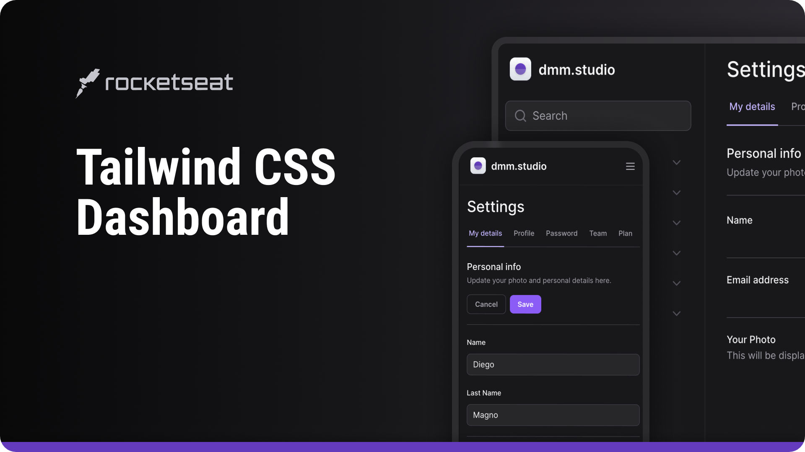

<h1 align="center">Tailwind Next Form Dashboard</h1>

 

  Click <a href="https://github.com/luc-ribeiro/form-tailwind-next/blob/main/README.md">here</a> to view the english version.

 
 

  

## 💻 Projeto
Desenvolvimento de interface de uma Dashboard onde foram abordados os fundamentos do Tailwind, estilizações, responsividade com breakpoints pré configurados, dark mode, Tailwind Variants, Radix UI, animações, Framer Motion, pattern de composição, criação de formulários, entre outros.

## 📝 Live Preview 

- [Tailwind Next Form Dashboard](https://form-tailwind-next.vercel.app)

## 🎨 Layout

- Você pode verificar o layout [aqui](https://www.figma.com/file/MU3H8HfTxX32ukt8ANpan7/Ignite-Tailwind?type=design&node-id=0%3A1&mode=design&t=8MDN59hWLgltXxOj-1). Você precisará de uma conta no [Figma](https://figma.com) para acessar.

## 🚀 Tecnologias

- Next
- TailwindCSS
- Radix UI
