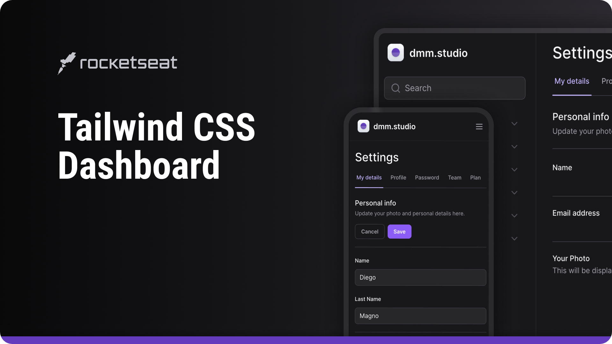

<h1 align="center">Tailwind Next Form Dashboard</h1>

 

  

 

## 📝 Live Preview 

- [Tailwind Next Form Dashboard](https://form-tailwind-next.vercel.app)

## 🎨 Layout

- Você pode verificar o layout [aqui](https://www.figma.com/file/MU3H8HfTxX32ukt8ANpan7/Ignite-Tailwind?type=design&node-id=0%3A1&mode=design&t=8MDN59hWLgltXxOj-1). Você precisará de uma conta no [Figma](https://figma.com) para acessar.

## 🚀 Tecnologias

- Next
- TailwindCSS
- Radix UI
